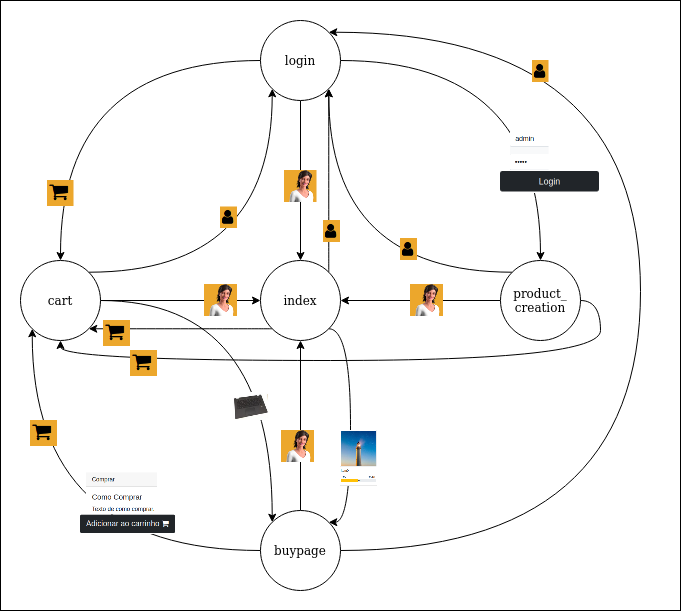

# USP - Introduction to Web Development (SCC0219) Project: Online group buying store

This is project is meant to serve as a way to put web development techiniques in practice. \
Theme: An Online Store

### Group Members: 

- Marcus Vinicius Castelo Branco Martins - 11219237
- Vinícius Eduardo de Araújo - 11275193
- Lucas Yuji Matubara	- 10734432
- Leonardo Paulo Dallagnol - 11795850

# Requirements

- The system must have 2 types of users: Clients and Administrators
  - Administrators are responsible for registering/managing administrators, customers, and products/services provided. The application already comes with an account admin with password admin. 
  - Customers are users who access the system to buy products/services.
- The admin record includes, at least: name, id, phone, email.
- Each customer's record includes, at least: name, id, address, phone, email
- Product/services records include, at least: name, id, photo, description, price, quantity (in stock), quantity sold.
- Your store may sell products, services or both (you decide)
- Selling Products (or services): Products are selected, their quantity chosen, and are included in a cart. Products are purchased using a credit card number (any number is accepted by the system). The quantity of product sold is subtracted from the quantity in stock and added to the quantity sold. Carts are emptied only on payment or by customers.
- Product/Service Management: Administrators can create/update/read/delete (crud) new products and services. For example, they can change the stock quantity.
- Your functionality: Create a functionality that is specific to your application. It does not have to be something complicated. For instance, if you are selling cars, you may allow users to use an accelerator to hear how each car engine roars up and down.   
- The system must provide accessibility requirements and provide good usability. The system must be responsive.

# Project Description

Inside the _Online Store_ theme, the group decided to implement a [Group Buying Store](https://en.wikipedia.org/wiki/Group_buying). The purpose of this store is to allow users to make colective buying. Therefore, massive quantity products can be delivered to different buyers in order to reduce the cost of shipping and of the products itself.

The online shopping is a marketplace where the dealers or owners of the products can propose sellings of big quantities of a given good. The main page of the website has 2 main structures, the hooverble item types and the carrousels of products. The item types are elements that expand into subtypes of itself, allowing the user to navigate through the main page and analize what items are available. When the last subitem is hoovered a carrousel appears showing the products of that subtype the person can buy. The other structure is the carrousel where products are shown. Some carrousels are fixed , as "for you" products or "in sale". The ones displayed when you reach the last subitem vary from type of product to type of product. Apart from the image, the current price of the product and the predicted price is also displayed. Due to the nature of the project, some prices can vary depending of how much will be bought. A progress bar is also shown to facilitate the understanding.
When the user clicks on a product image inside a carrousel, the pages direct them to the product page. You can always return to the main page by clicking onto the webstore symbol - in this first mock-up is being used.

In the product page, an image and description is displayed describing the base characteristics. In conjunction, a side bar to the right exists, displaying the milestones of price reduction (A product can, for example, have a unit price of $2 if 200 or less units are bought, or $1 if more than this is purchased). Bellow the product description, a progress bar exists, showing to the user how much of this product has been assigned to purchase. In this progress bar, carret spots indicates in which phase of the progress a price reduction will occour. When you click in a carret, or an item of the side bar, just the carret-side-bar-item pair will be visible. In place of the remaining side bar items a description about the given milestone will appear. Bellow all side bar items a "Buy" element exists, when you click it, it expands and allows the user to add the item to its shopping cart.

When you click the cart item in the top bar it redirects th user to the assigned page. In the cart page, the product the user has choosen will appear. In each product, an image representation and its expecifications are displayed. To the right side of it you can add or reduce units of that product of your cart and the total price adjusts accordantly. It also shows you how much more of that products you must buy to reach a milestone, and what the pack price will be when it happens. When you reach the milestone the unit price is updated. To be able to purchase a product it must have been registered by a seller.
People who have access to add products can navigate to the product creation page by logging-in with an administrator login and password - this can be done in this project by seting both login and password as 'admin' and hitting log-in. In the add products page you can add a new product by expecifying its image, description and milestone prices. The milestones can be added by clicking onto the 'Add Item'. At 'Add Item' you can specify the quantity threshold and its price. After setting the product characteristics you can add it to the available items of the marketplace. You must be logged in to be able to purchase the product. 

To log, you must first be registered in the website. You can access it by clicking in the person symbol at the main page top bar. The login and sign-in page are located in the same page. To change from the login to the sign-in mode, you must click on the **Create Account** button. If you want to return to the **Login** one you must click on the **Already Have an Account** button. Password and Confirm Password must me the same to allow registration.

# Navigation Diagram and Figma mock-ups considerations
the Navigation Diagram wasn't done separetly once the htmls already implements the redirect scheme - this was explained in the Project Description topic. To the same extent, the Figma files were not created. This happened once 5 html files were already created - **buypage**, **cart**, **login**, **product_creation** and **index** - with responsive css,html and javascript. jQuery and Bootstrap 5 were also used to make the project dynamic. Bellow the way to navigate through the pages are shown.

# Comments About the Code
A great part of the html is generated by javascript DOM manipulation. Because of this, the source code in not in its integrity in the .html file. The index.html file - where the main page exists - is at ./frontend , the remaining pages are at ./frontend/pages . All the javascript files are at ./frontend/js and all css files are at ./frontend/js
# Test Plan: Text describing the tests that will be performed. If an automatic test tool/framework is used.
# Test Results
# Build Procedures
By clicking in the ./frontend/index.html file you can navigate through all the other html files.
# Problems
# Comments
